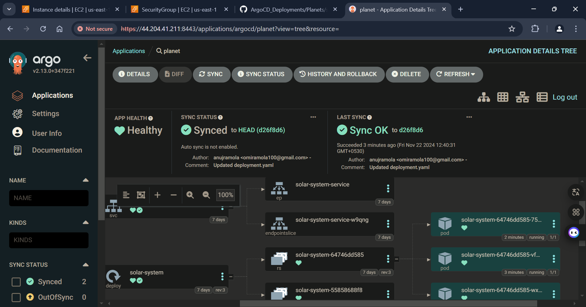
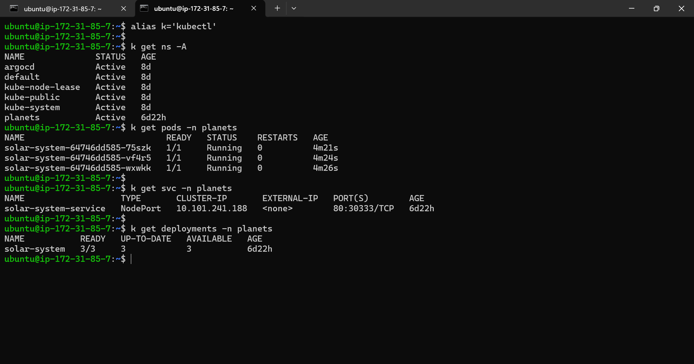

**OVERVIEW:**

***The planet project contains the simulation of planets around the solar system.***
**- The simulation image is already present in the docker hub registry.**
**- The image has various tage ranging from v1 to v9.**
**- v1 represents the single star in our solar system i,e sun.**
**- Similarly as the number in tag increases the number of planets also increases with v9 marking all the 9 planets.**

**SETUP OVERVIEW:**
For this project I am utilising the AWS t2.medium instance.
1) For running ARGOCD server we need Minikube cluster or you can also utilise EKS service from AWS, for this demo, I have utilised Single node minikube cluster.
2) Argocd is installed on the top of this minikube cluster in argocd namespace having its own resource configuration.
3) For running the argocd server I have used port forwarding technique after exposing the nodePort service.
4) For running the application and getting the endpoint url of the service which is running on argocd server (in our case the planet application) is also exposed with the help of port forwarding technique.

**Minikube_argocd_instance:**

**Security_Inbound_rules:**

**Minikube_status:**

**Argocd_namespace_and_pods:**

**Argocd_server:**

**Port_forward for argocd_server:**

**Argocd_UI:**

Note: I have already deployed the application so hpw deployment is done is not shown here:
**But the configuration is something like this:**

***My application state in Argocd is currently out of sync since i have updated the tag from v6 to v9 for docker image.***

**Out_of_sync_application:**

When the application is synced you will notice that the sync state to be "SYNCED":

**Resources:**
All the reources created by argocd as shown by CLI are:

To access the application I am using port forward technique for the given nodePort:

**The application GUI:**

