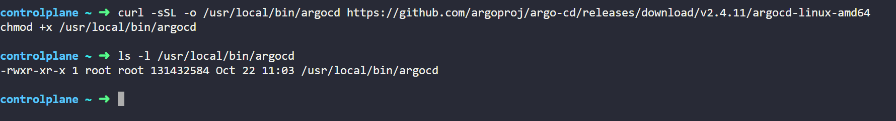

# ArgoCD_Deployments
**The steps to install Argo CD in a non-high availability (non-HA) setup until the installation using the URL:**

### Steps for Installing Argo CD (Non-HA)

#### Step 1: Create a Namespace for Argo CD
Create a dedicated namespace for Argo CD:

```bash
kubectl create namespace argocd
```

#### Step 2: Apply the Argo CD Install Manifest
Download and apply the `install.yaml` manifest provided by Argo CD:

```bash
kubectl apply -n argocd -f https://raw.githubusercontent.com/argoproj/argo-cd/stable/manifests/install.yaml
```


To get ARGOCD-server password

```bash
kubectl -n argocd get secrets argocd-initial-admin-secret -o json | jq .data.password -r | tr -d '\n' | base64 -d
```

1. **`kubectl -n argocd get secrets argocd-initial-admin-secret -o json`**:
   - **`kubectl`**: The command-line tool for interacting with Kubernetes.
   - **`-n argocd`**: Specifies the namespace (`argocd`) where the secret is located.
   - **`get secrets argocd-initial-admin-secret`**: Retrieves the secret named `argocd-initial-admin-secret`.
   - **`-o json`**: Outputs the secret in JSON format.

2. **`| jq .data.password -r`**:
   - **`|`**: This is a pipe that takes the output of the previous command and sends it as input to the next command.
   - **`jq`**: A command-line tool for processing JSON data.
   - **`.data.password`**: This filters the JSON output to extract the `password` field located under the `data` section of the secret.
   - **`-r`**: This option tells `jq` to output raw strings (without quotes).

3. **`| tr -d '\n'`**:
   - **`tr`**: A command that translates or deletes characters.
   - **`-d '\n'`**: This option deletes newline characters from the output. This ensures that the password is returned as a single line without any line breaks.

4. **`| base64 -d`**:
   - **`base64`**: A command-line utility to encode and decode base64 data.
   - **`-d`**: This option tells `base64` to decode the input.
   - The previous commands have filtered the base64-encoded password, and this command decodes it to return the actual password.


To install ARGOCD CLI :
***curl -sSL -o /usr/local/bin/argocd https://github.com/argoproj/argo-cd/releases/download/v2.4.11/argocd-linux-amd64***

***chmod +x /usr/local/bin/argocd***

### Command Breakdown

1. **`curl -sSL -o /usr/local/bin/argocd https://github.com/argoproj/argo-cd/releases/download/v2.4.11/argocd-linux-amd64`**:
   - **`curl`**: A command-line tool used to transfer data from or to a server using various protocols (HTTP, HTTPS, etc.).
   - **`-sSL`**: These are options for `curl`:
     - **`-s`**: Silent mode. It disables progress meter and error messages.
     - **`-S`**: Show error messages when used with `-s`. If there's an error, it will be displayed.
     - **`-L`**: Follow redirects. If the URL redirects to another location, `curl` will follow the redirect.
   - **`-o /usr/local/bin/argocd`**: This option specifies the output file. The downloaded file will be saved as `argocd` in the `/usr/local/bin` directory, which is typically included in the system's PATH.
   - **`https://github.com/argoproj/argo-cd/releases/download/v2.4.11/argocd-linux-amd64`**: This is the URL from which the Argo CD CLI binary is downloaded. It points to the specific release (v2.4.11) for Linux on amd64 architecture.

2. **`chmod +x /usr/local/bin/argocd`**:
   - **`chmod`**: A command used to change the permissions of files or directories.
   - **`+x`**: This option adds execute permission to the file.
   - **`/usr/local/bin/argocd`**: This specifies the path of the file for which you want to add execute permissions.


- The first command downloads the Argo CD CLI tool for Linux and saves it to `/usr/local/bin/argocd`.
- The second command makes the downloaded `argocd` file executable, allowing you to run it from the command line.

To verify the permission, you will see that last three modes are read and execute for others.



TO use PORTFORWARD technique for viewing argocd UI:
***kubectl port-forward --address 0.0.0.0 svc/argocd-server -n argocd 8080:443***
